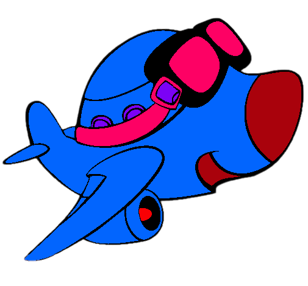

# AIRPLANE WAR!

## [Play the Game!](https://0mararal0.github.io/Proyect-Airplane-War/)

# Description

AIRPLANE WAR! es un juego para todos los públicos. Desde la pantalla principal podremos iniciar el juego, ver los controles y ver el historial de puntuación.
Su objetivo es eliminar todos los aviones enemigos posibles y sumar puntos, aunque habrá que tener cuidado con las bolas de fuego que te podrán matar. Cualquier colisión con una bola de fuego o un avion enemigo hará perder el juego.
Se dispone de 30 segundos para sumar la mayor puntuación posible, a lo largo del juego te aparecerá FUEL que te añadirá tiempo extra.

# Main Functionalities

- Movimiento del jugador.
- Disparo del jugador.
- Movimiento de aviones enemigo.
- Movimiento de bolas de fuego.
- Movimiento de Fuel Extra.
- Detección de colisiones jugador - avion enemigo.
- Detección de colisiones jugador - bola de fuego.
- Detección de colisiones jugador - Fuel Extra.
- Temporizador de juego.
- Incremento de temporizador de juego.
- Aviso de tiempo Low en el juego.
- Hi-Score.
- Aumento de nivel por puntuacion obtenda.
- Aumento de dificultad por subida de nivel.
- Almacenaje de datos en Local-Storage.

# Backlog Functionalities

- Escudo temporal en avion.
- Mas niveles con otros objetos enemigos.
- Sonido

# Technologies used

- HTML.
- CSS.
- JavaScript.
- Manipulacióndel DOM.
- Almacenamiento Local-Storage.

# States

- Pantalla principal.
- Pantalla Controles.
- Pantalla historial Hi-Score.
- Pantalla juego.
- Pantalla Game Over.

# Proyect Structure

- List here sections for your your different JS files.
- One for main.js to manage DOM elements, one for the Game class and one for each other class file of your game.
- Inside each file you can list the functions, clases, properties and methods of your code.

Example:

## main.js

- Declaramos las pantallas principales del DOM.
- Declaramos los botones principales del DOM.
- Declaramos variables principales.
- Generamos la funcion que escribe texto en la pantalla principal.
- Generamos la funcion para un movimiento fluido del jugador.
- Generamos la funcion principal de inicio del juego.
- Generamos la funcion gameLop para movimientos principales.
- Generamos la funcion añadir disparos.
- Generamos la funcion mover disparos.
- Generamos la funcion eliminar disparos del DOM y JS.
- Generamos la funcion añadir aviones enemigos.
- Generamos la funcion mover aviones enemigos.
- Generamos la funcion eliminar aviones enemigos del DOM y JS.
- Generamos la funcion añadir bolas de fuego.
- Generamos la funcion mover bolas de fuego.
- Generamos la funcion eliminar bolas de fuego del DOM y JS.
- Generamos la funcion añadir bolas de fuego.
- Generamos la funcion mover bolas de fuego.
- Generamos la funcion eliminar bolas de fuego del DOM y JS.
- Generamos la función detectar disparo.
- Generamos la función detectar colision avion enemigo.
- Generamos la función detectar colision bola de fuego.
- Generamos la función detectar colision fuel.
- Generamos la función mover de nivel.
- Generamos la función nivel1.
- Generamos la función nivel 2.
- Generamos la función nivel 3.
- Generamos la función nivel 4.
- Generamos la función nivel 5.
- Generamos la función nivel 6.
- Generamos la función gameOver.
- Generamos la función guardar en Local-Storage.
- Generamos la función añadir Score local.
- Generamos la función añadir Score array.
- Generamos la función añadir mostrar marcador Score.
- Generamos la función cambiar de vista Score.
- Generamos la función cambiar de Controls.
- Añadimos los Event Listeners.

## Player.js

- Generamos la clase PlayerPlane.
- Añadimos parametros al constructor.
- Generamos el método de movimiento.

## FirePlayer.js

- Generamos la clase FirePlayer.
- Añadimos parametros al constructor.
- Generamos el método fire(disparo).

## EnemyPlane.js

- Generamos la clase EnemyPlane.
- Añadimos parametros al constructor.
- Generamos el método de movimiento automático.

## FireBall.js

- Generamos la clase FireBall.
- Añadimos parametros al constructor.
- Generamos el método de movimiento automático.

## Fuel.js

- Generamos la clase Fuel.
- Añadimos parametros al constructor.
- Generamos el método de movimiento automático.

# Extra Links

### Sketch

[Link](https://excalidraw.com/#json=g5frNY4k4qQG765C_ta1O,U_xTJECTk9qZ62bRJjdeVw)

### Slides

[Link](https://docs.google.com/presentation/d/1Fhfw0lBF7SwyAJaeIZECH-BYbBbErbStldZozLwsSa0/edit?usp=sharing)

## Deploy

[Link](https://0mararal0.github.io/Proyect-Airplane-War/)
